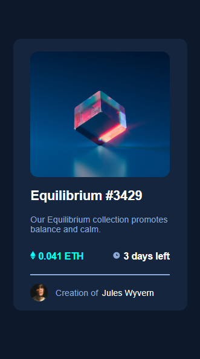
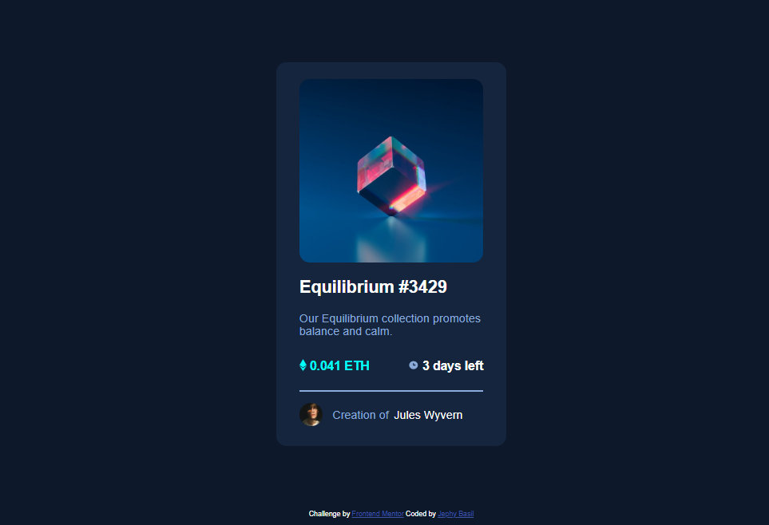

# Frontend Mentor - NFT preview card component solution

This is a solution to the [NFT preview card component challenge on Frontend Mentor](https://www.frontendmentor.io/challenges/nft-preview-card-component-SbdUL_w0U). Frontend Mentor challenges help you improve your coding skills by building realistic projects. 

## Table of contents

- [Overview](#overview)
  - [The challenge](#the-challenge)
  - [Screenshot](#screenshot)
  - [Links](#links)
- [My process](#my-process)
  - [Built with](#built-with)
  - [What I learned](#what-i-learned)
  - [Continued development](#continued-development)
- [Author](#author)
- [Acknowledgments](#acknowledgments)

**Note: Delete this note and update the table of contents based on what sections you keep.**

## Overview

### The challenge

Users should be able to:

- View the optimal layout depending on their device's screen size
- See hover states for interactive elements

### Screenshot

### Links

- Solution URL: (https://github.com/Jephyy/NFT-Card)
- Live Site URL: (https://jephyy.github.io/NFT-Card/)

## My process

### Built with

- Semantic HTML5 markup
- CSS custom properties
- Flexbox

### What I learned

I learnt how to vertically align elements.
I learnt how to optimize my page for mobile view.
I learnt how to use CSS flexbox.

### Continued development

I will continue using css flexbox to properly understand it's functions

## Author

- Website - Jephy
- Frontend Mentor - (https://www.frontendmentor.io/profile/Jephyy)
- Twitter - (https://www.twitter.com/the_real_lynk)

## Acknowledgments
Henry Agu helped me out at some points by giving me ideas of what to do when i got stuck at some point.